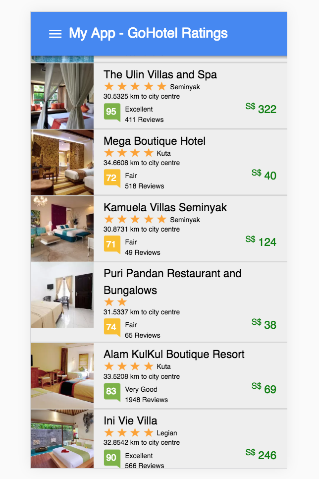

# Polymer App : GoHotel Ratings Project

## Project Description 

A demo page using an API Endpoint to display each individual hotel information.

The project is built with Polymer 3.0.



### Setup

##### Prerequisites

Install [Polymer CLI](https://github.com/Polymer/polymer-cli) using
[npm](https://www.npmjs.com) (we assume you have pre-installed [node.js](https://nodejs.org)).

    npm install -g polymer-cli@next

##### Install project dependencies

    npm install

##### Initialize project from template

    polymer serve

### Start the development server

This command serves the app at `http://127.0.0.1:8081` and provides basic URL
routing for the app:

    npm start

### Build

The `npm run build` command builds your Polymer application for production, using build configuration options provided by the command line or in your project's `polymer.json` file.

You can configure your `polymer.json` file to create multiple builds. This is necessary if you will be serving different builds optimized for different browsers. You can define your own named builds, or use presets. See the documentation on [building your project for production](https://www.polymer-project.org/3.0/toolbox/build-for-production) for more information.

The Polymer Starter Kit is configured to create three builds. These builds will be output to a subdirectory under the `build/` directory as follows:

```
build/
  es5-bundled/
  es6-bundled/
  esm-bundled/
```

* `es5-bundled` is a bundled, minified build with a service worker. ES6 code is compiled to ES5 for compatibility with older browsers.
* `es6-bundled` is a bundled, minified build with a service worker. ES6 code is served as-is. This build is for browsers that can handle ES6 code - see [building your project for production](https://www.polymer-project.org/3.0/toolbox/build-for-production#compiling) for a list.
* `esm-bundled` is a bundled, minified build with a service worker. It uses standard ES module import/export statements for browsers that support them.

Run `polymer help build` for the full list of available options and optimizations. Also, see the documentation on the [polymer.json specification](https://www.polymer-project.org/3.0/docs/tools/polymer-json) and [building your Polymer application for production](https://www.polymer-project.org/3.0/toolbox/build-for-production).

### Preview the build

This command serves your app. Replace `build-folder-name` with the folder name of the build you want to serve.

    npm start build/build-folder-name/


If running Windows you will need to set the following environment variables:

- LAUNCHPAD_BROWSERS
- LAUNCHPAD_CHROME

Read More here [daffl/launchpad](https://github.com/daffl/launchpad#environment-variables-impacting-local-browsers-detection)

### Techniques for speed/optimisation

As we do not need the user to know upfront how many hotels are in the list,  InitialCount and TargetFramerate have been added to improve the performance. With them, the hotel list is executed and displayed in "chunked" rendering instead of the entire list at once. 

### Contact

Email: gdleow@gmail.com

---

Looking for our older PSK2 Polycast or migration blog post? See [the previous README](https://github.com/Polymer/polymer-starter-kit/blob/v3.2.1/README.md).
